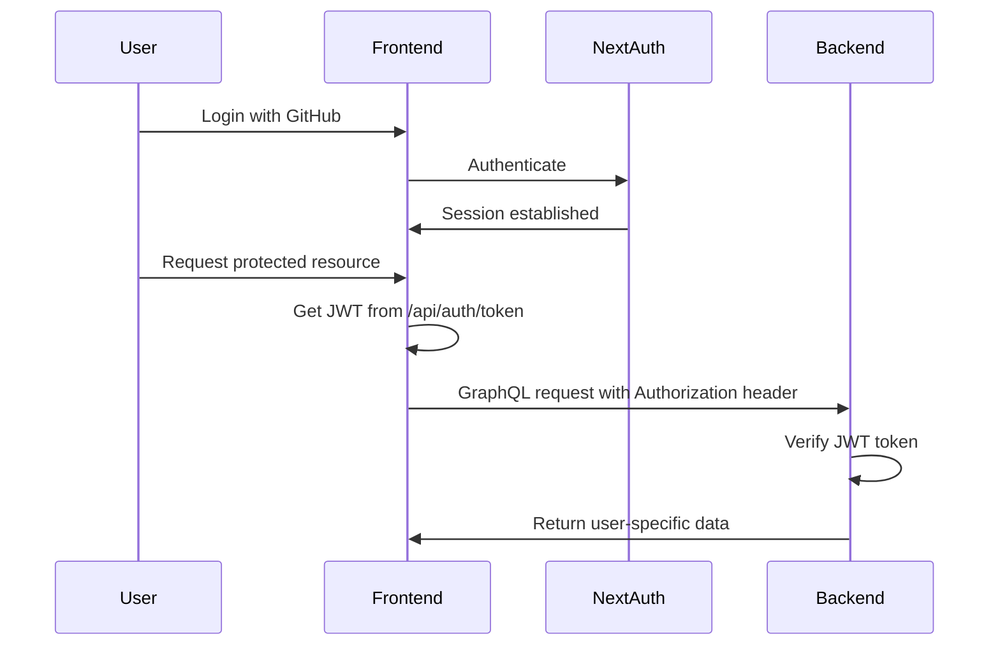

# JWT Authentication Guide

Your Aspaire project now has JWT authentication set up between your Next.js frontend and GraphQL backend.

## How It Works

1. **Frontend**: Uses NextAuth v5 with GitHub OAuth
2. **Token Generation**: Frontend creates JWT tokens using Web Crypto API (Edge Runtime compatible)
3. **Backend**: Verifies JWT tokens using `jsonwebtoken` library (Node.js compatible)

## Authentication Flow



## Frontend Usage

### 1. Get JWT Token
```javascript
// In your React components
const response = await fetch('/api/auth/token');
const { token } = await response.json();
```

### 2. Use Token in GraphQL Requests
```javascript
const client = new ApolloClient({
  uri: 'http://localhost:4000/graphql',
  headers: {
    authorization: token ? `Bearer ${token}` : '',
  }
});
```

## Backend Usage

### 1. Protected Resolvers
```javascript
// Require authentication
export const myResolver = {
  Query: {
    myData: async (_, args, context) => {
      const user = requireAuth(context); // Throws error if not authenticated
      const userId = user.sub || user.email;
      return await getData(userId);
    }
  }
}
```

### 2. User Ownership Checks
```javascript
// Ensure user can only access their own data
export const myResolver = {
  Mutation: {
    updateMyData: async (_, { id, input }, context) => {
      const user = requireAuth(context);
      const data = await getDataById(id);
      
      if (data.user_id !== (user.sub || user.email)) {
        throw new Error('Unauthorized');
      }
      
      return await updateData(id, input);
    }
  }
}
```

### 3. Optional Authentication
```javascript
// Optional auth (user can be null)
export const myResolver = {
  Query: {
    publicData: async (_, args, context) => {
      const user = getOptionalUser(context); // Returns null if not authenticated
      
      if (user) {
        // Return personalized data
        return await getPersonalizedData(user.sub);
      } else {
        // Return generic data
        return await getPublicData();
      }
    }
  }
}
```

## Available Auth Functions

### `requireAuth(context)`
Throws error if user is not authenticated. Returns user object if authenticated.

### `requireUserId(context, userId)`
Ensures the authenticated user ID matches the provided userId. Useful for user-specific operations.

### `getOptionalUser(context)`
Returns user object if authenticated, null otherwise. For optional authentication.

### `generateToken(payload, expiresIn)`
Generate a JWT token (mainly for testing).

### `verifyToken(token)`
Verify a JWT token and return decoded payload.

## Testing

1. **Run the test script**:
   ```bash
   cd backend
   node test-auth.js
   ```

2. **Use the HTTP test file**:
   - Open `.http/auth_test.rest`
   - Get a token from your frontend first
   - Replace `YOUR_JWT_TOKEN_HERE` with the actual token
   - Run the requests

## Security Notes

- JWT tokens expire after 24 hours
- Tokens are signed with your `JWT_SECRET` environment variable
- Always validate user ownership for sensitive operations
- The frontend uses Web Crypto API (Edge Runtime compatible)
- The backend uses Node.js jsonwebtoken library

## Environment Variables Required

```env
JWT_SECRET=your-secret-key-here
GITHUB_CLIENT_ID=your-github-client-id
GITHUB_CLIENT_SECRET=your-github-client-secret
```

## Common Patterns

### 1. User-specific Data Access
```javascript
const user = requireAuth(context);
const userId = user.sub || user.id || user.email;
return await getUserData(userId);
```

### 2. Resource Ownership Check
```javascript
const user = requireAuth(context);
const resource = await getResource(id);
if (resource.user_id !== (user.sub || user.email)) {
  throw new Error('Unauthorized');
}
```

### 3. Auto-inject User ID
```javascript
const user = requireAuth(context);
const input = {
  ...args.input,
  user_id: user.sub || user.email
};
```

That's it! Your JWT authentication is ready for your personal MVP project. 🚀
